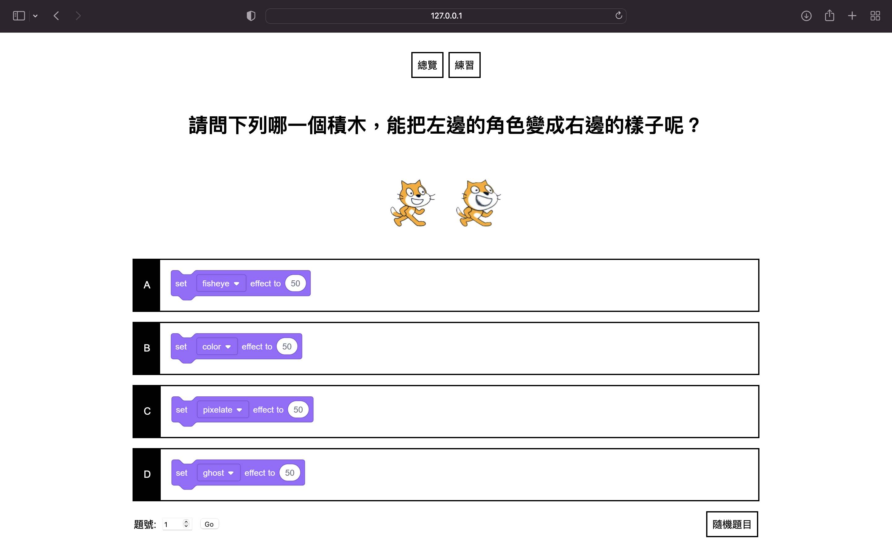

# Scratch題庫測驗
此應用使用Python，以Flask做為後端，使用openpyxl提取Excel檔內容來製作測驗網頁。


## 安裝
### 在資料夾中建立虛擬環境
Windows:
```
py -3 -m venv venv
```
macOS/Linux:
```
python3 -m venv venv
```
### 啟動虛擬環境
Windows:
```
venv\Scripts\activate
```
macOS/Linux:
```
. venv/bin/activate
```
### 在虛擬環境中安裝元件
```
pip install flask
pip install openpyxl
```
## 啟動網頁後端
進入虛擬環境後，使用以下指令啟動後端:
```
flask run
```
接下來在瀏覽器網址欄輸入`127.0.0.1:5000`以開啟網頁。
